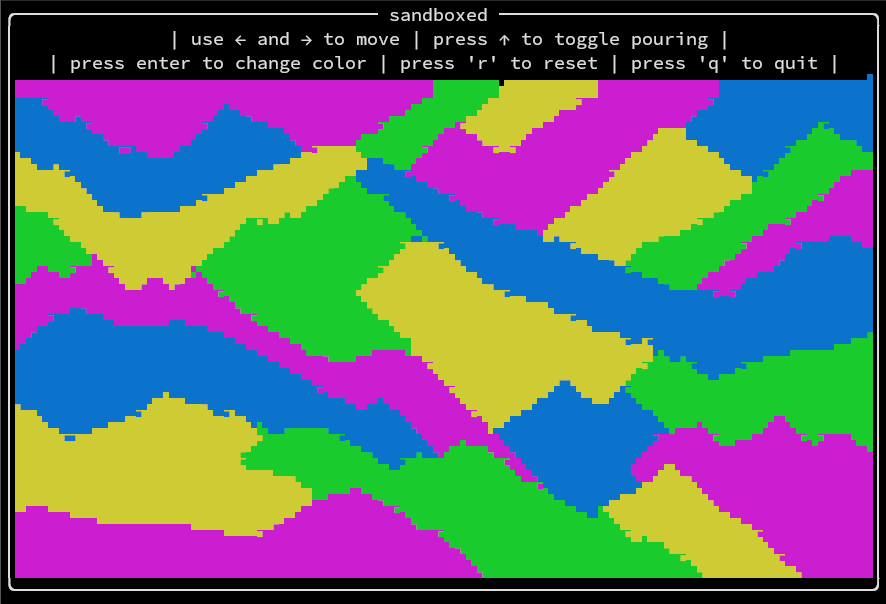

# sand:boxed

**A falling sand simulator in the terminal!**

## Installation

If you're on x86 Linux, you can use the executable in the release. Just download it, use `chmod +x /path/to/file` to give it executable permissions, and run it with `/path/to/file`.

1. [Install Rust](www.rust-lang.org/tools/install). If you've used Rust before, you can skip this.
2. Clone the repository with git
3. Open the repository and use `cargo run`

## Usage

There's a bar at the top of the screen that represents the faucet, where sand pours out of. Use the left and right arrows to move it and the up arrow to toggle pouring the sand. Press enter to cycle the sand's color between yellow, blue, green, and magenta. Press 'r' to reset the whole sandbox, and press 'q' to leave the program.
